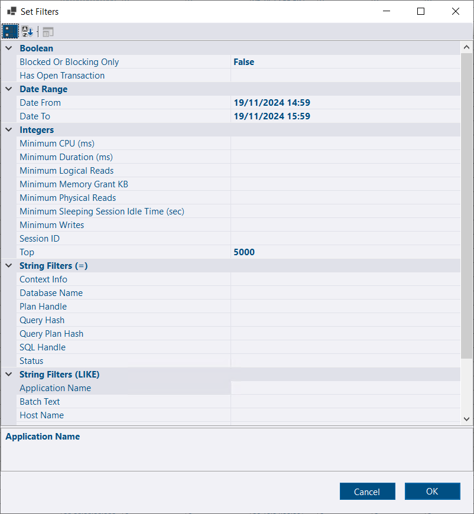

## Running Queries - View all

A new *View ALL* button is available on the *Running Queries* tab when viewing the list of snapshots for a particular instance.

[](running-queries-view-all.png)

Clicking this button will open a *Set Filters* dialog where you can set any appropriate filters.  Clicking OK will then show data across all the running queries snapshots for the selected time period.

[](running-queries-set-filters.png)


Running Query snapshots capture what was running at the specific point in time the collection query ran.  The next time the collection runs, some queries might still be running and the queries are captured again at a different stage of it's execution.  Between the collections you might also have very large quantities of queries executing and completing that are never captured by the running queries snapshots.

It doesn't provide a full picture of activity on your server.  Looking at the data in aggregate across snapshots, there will be duplication as it captures different stages of the same queries execution.

The snapshots are useful for identifying a number of SQL Server issues - from blocking to tempdb contention.  With the limitations understood, querying across snapshots is a really powerful feature that previously required querying the repository database directly.


## New [Community Tools](/docs/help/community-tools/)

Support has been added for [sp_SrvPermissions](https://github.com/sqlstudent144/SQL-Server-Scripts/blob/main/sp_SrvPermissions.sql) and [sp_DBPermissions](https://github.com/sqlstudent144/SQL-Server-Scripts/blob/main/sp_DBPermissions.sql) by [Kenneth Fisher](https://sqlstudies.com/about/).  *sp_SrvPermissions* provides reports on server level principals, role membership and permissions and *sp_DBPermissions* provides database level principals, role membership and permissions.

To use these procedures, ensure they are listed in the Allowed Community Scripts in the service configuration tool or it's set to "*" to allow all.The *Enable Communication* option also needs to be checked and the service account needs access to run these stored procedures.

The scripts can be deployed using:

```pwsh
############# Setup ##############

## Instances to Deploy to
$SQLInstances = "SQL1","SQL2"

# DBA Dash service account user ($ at end for managed service account)
$DBADashServiceAccount = "YourDomain\DBADash$"

###################################

## Kenneth Fisher's permission tools

$sp_SrvPermissions = (Invoke-WebRequest -Uri "https://raw.githubusercontent.com/sqlstudent144/SQL-Server-Scripts/refs/heads/main/sp_SrvPermissions.sql").Content
Invoke-DbaQuery -SqlInstance $SQLInstances -Query $sp_SrvPermissions

$sp_DBPermissions = (Invoke-WebRequest -Uri "https://raw.githubusercontent.com/sqlstudent144/SQL-Server-Scripts/refs/heads/main/sp_DBPermissions.sql").Content
Invoke-DbaQuery -SqlInstance $SQLInstances -Query $sp_DBPermissions

$GrantSQL = "GRANT EXECUTE ON sp_SrvPermissions TO [" + $DBADashServiceAccount + "]
GRANT EXECUTE ON sp_DBPermissions TO [" + $DBADashServiceAccount + "]"

Invoke-DbaQuery -SqlInstance $SQLInstances -Query $GrantSQL
```

## Grid Improvements

A *Copy Column* option has been added.  An example of where this might be useful is grabbing the scripts generated when you run *sp_SrvPermissions* & *sp_DBPermissions*.

## Other

CLI now has options for UseDualEventSession & PersistXESessions.
Link Columns in custom reports now support folder paths.

See [3.15.0](https://github.com/trimble-oss/dba-dash/releases/tag/3.15.0) release notes for a full list of fixes.

