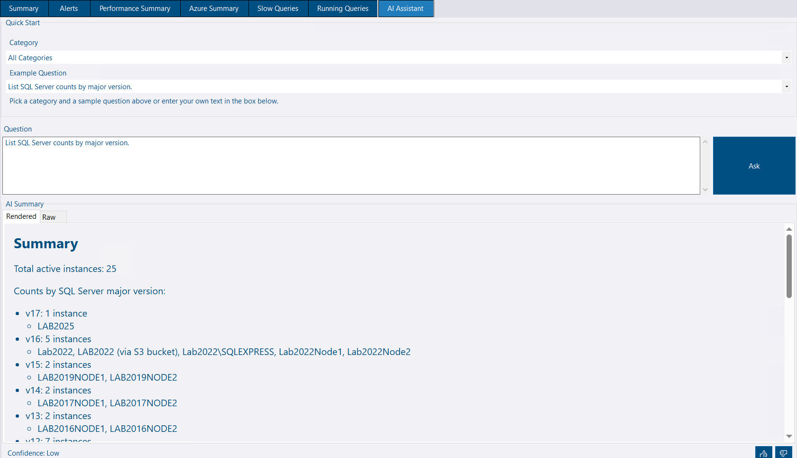
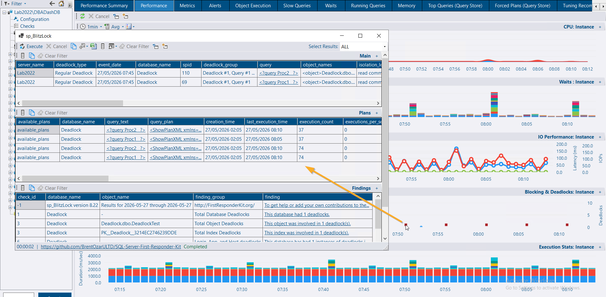
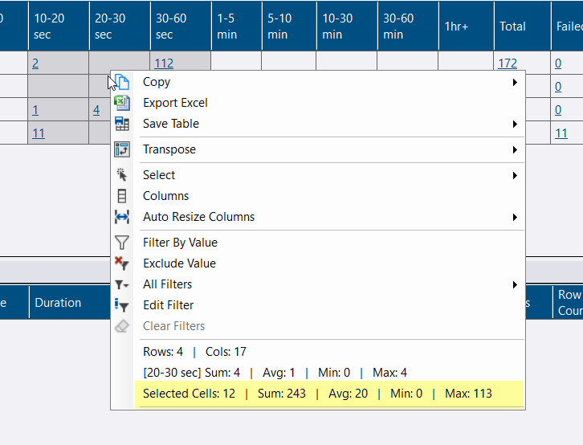

## AI Assistant

The new AI Assistant lets you ask natural-language questions about your SQL Server estate and receive answers drawn directly from the data stored in your DBA Dash repository.

A **Quick Start** panel offers categorised example questions to help you get started. Type any question in plain English, click **Ask**, and the assistant returns results from the AI service as a formatted summary. A confidence indicator at the bottom of the response lets you gauge how reliable the answer is.

The **AI Assistant** tab is visible in the main interface but requires a separate AI service to be configured and running. The service supports **Azure OpenAI** and other providers, and is set up via the **AI Service** tab in the **Service Configuration** tool. See the [AI Assistant docs](/docs/help/ai-assistant) for full setup instructions.

🙏 Thank you to [goldenjacob](https://github.com/goldenjacob) for contributing this feature!

The AI Assistant and its supporting service are at an early stage. If you'd like to help improve it — whether that's better prompts, additional provider support, UI polish, or documentation — pull requests are very welcome on the [DBA Dash GitHub repository](https://github.com/trimble-oss/dba-dash).

## Blocking chart — deadlock links

Deadlock squares on the **Blocking** chart are now clickable. Clicking one runs `sp_BlitzLock` directly against the monitored instance, scoped to a narrow time window around the selected event — giving you immediate access to query text, execution plans, and findings for that specific deadlock.

This is similar to the existing **Show Deadlocks** button but targeted to the exact event rather than the full date range. The feature uses the messaging system and requires `sp_BlitzLock` from the [First Responder Kit](https://github.com/brentozarultd/sql-server-first-responder-kit) to be configured as a [community tool](/docs/help/community-tools).

## Grids — selected cell aggregations

The grid context menu now shows aggregations for the **selected cells** in addition to the existing column-level summary. Highlight any range of cells and the context menu displays the cell count, sum, average, min, and max — similar to Excel.

## Other improvements

See the [4.10.0 release notes](https://github.com/trimble-oss/dba-dash/releases/tag/4.10.0) for a full list of fixes and improvements.
