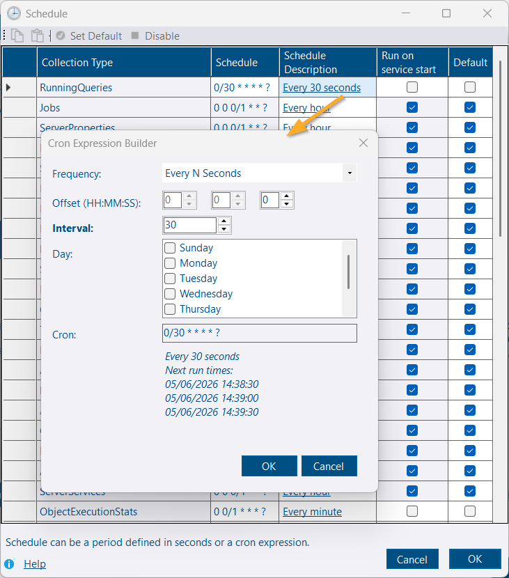
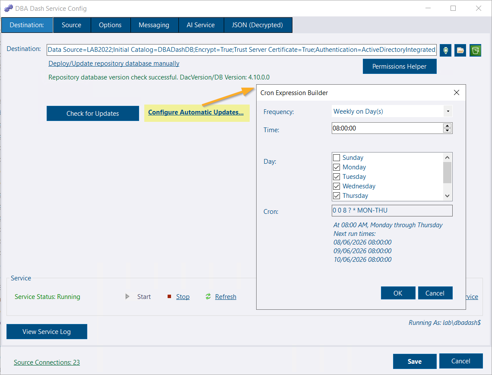
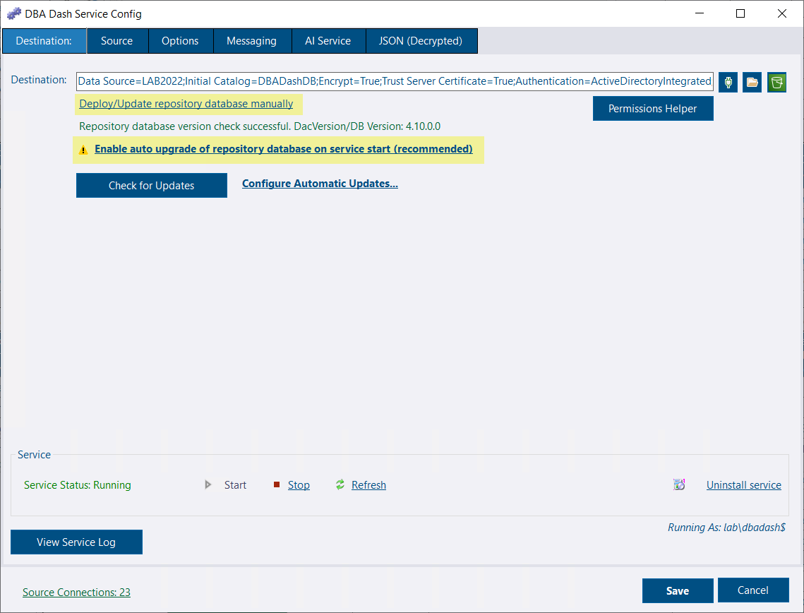
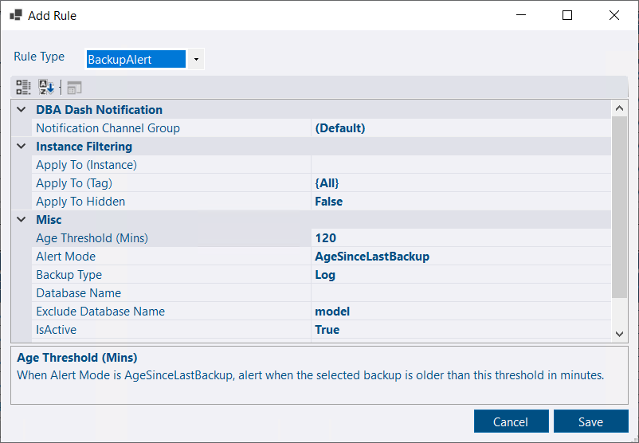

## AI Service improvements

[goldenjacob](https://github.com/goldenjacob) contributed improvements to the AI service (see [PR 1902](https://github.com/trimble-oss/dba-dash/pull/1902)) that make it easier to identify why agent jobs fail.

## Cron expression builder

The service configuration UI now includes a cron expression builder so you can create schedules without memorizing cron syntax or using external tools. It's integrated into the scheduler settings to reduce mistakes and speed setup.

## Automatic updates (GUI configuration)

Automatic updates were introduced in [4.9](https://dbadash.com/blog/whats-new-in-4.9/) and previously required editing `UpgradeCheckCron` manually. With 4.11.0, you can now configure the update schedule from the GUI using the cron builder.

Upgrade checklist:
- The service account must be able to start/stop the service and terminate GUI instances to avoid locked-file conflicts.
- The service account must have write access to the application folder.
- Keep regular backups of the repository database and service configuration before upgrading.
- GUI clients are not auto-upgraded; users will be prompted to upgrade after the service updates.


A failed update could leave you running without monitoring. Ensure backups and a rollback plan before enabling automatic updates.


## Other service config tool improvements

- The UI no longer exposes the option to disable repository database updates. That setting (`"AutoUpdateDatabase": false`) still exists, but hiding it reduces accidental misconfiguration. If detected, the UI shows a warning with a one-click link to re-enable automatic DB updates.
- The Deploy/Update database action is now a link rather than a prominent button — database deployments still occur automatically when a version change is detected.

## Backup alert rule

Missing backups are highlighted on the Summary tab and can now trigger alert notifications. LOG backups are particularly time-sensitive and may require immediate attention.

* **LOG Backups:** If LOG backups stop, your Recovery Point Objective (RPO) is immediately affected. Furthermore, without LOG backups, log truncation is prevented—meaning log files will grow until they exhaust disk space and cause system-wide failures.
* **FULL/DIFF Backups:** Missing a FULL or DIFF backup primarily impacts your Recovery Time Objective (RTO), provided your databases are in FULL recovery mode and you have an unbroken chain of LOG backups. However, if you are using SIMPLE recovery, your RPO will be impacted. Note that without at least one valid FULL backup, you cannot recover the database at all.

Alert modes:
- `AgeSinceLastBackup` — e.g., trigger if no LOG backup in 2 hours.
- `Status` — reuse thresholds from the Summary tab for your daily checks.

## Other improvements

See the [4.11.0 release notes](https://github.com/trimble-oss/dba-dash/releases/tag/4.11.0) for a full list of fixes and improvements.
