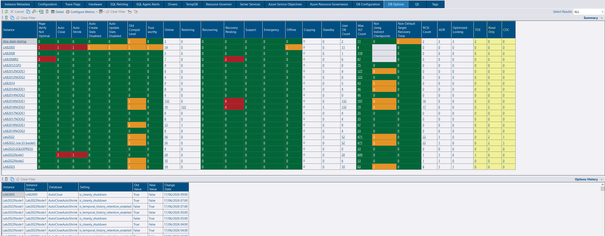
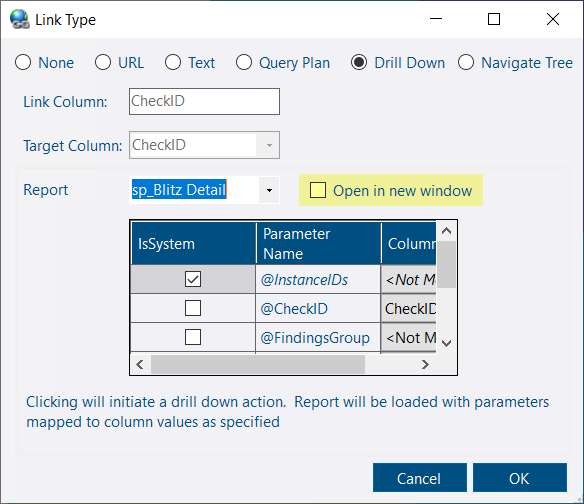
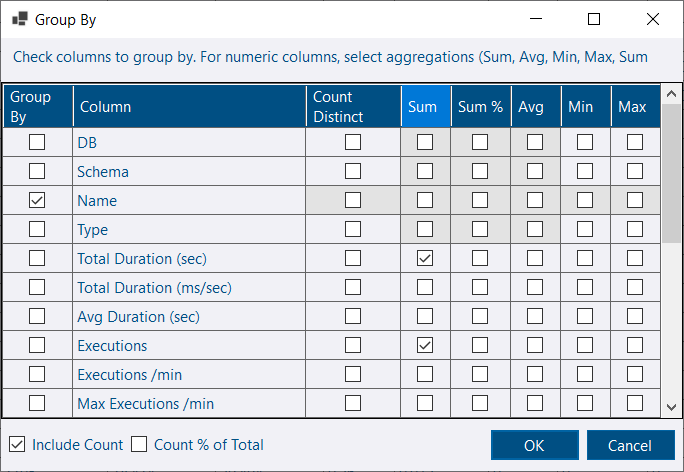
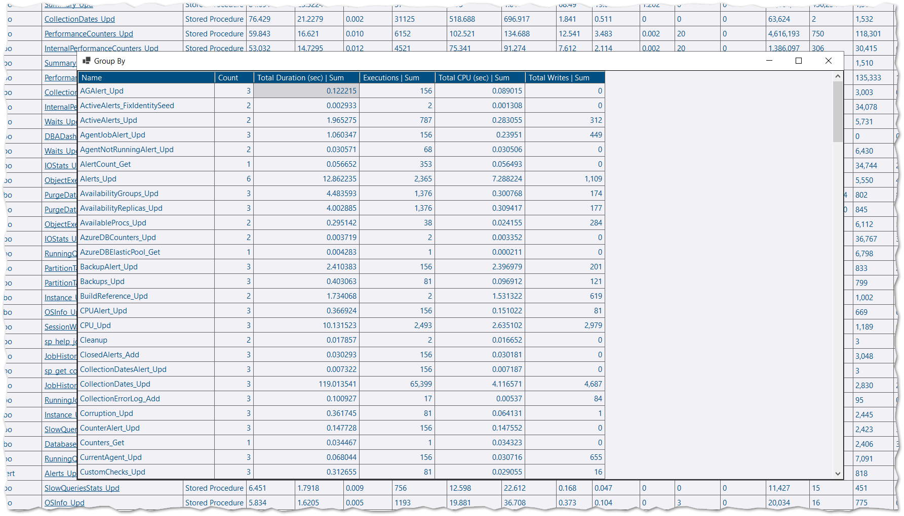
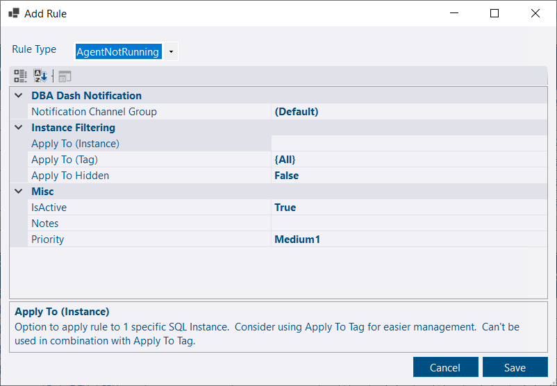

## DB Options tab update

The Summary view now includes the following new columns:

* **TDE** — a count of databases with Transparent Data Encryption (TDE) enabled.
* **CDC** — a count of databases with Change Data Capture (CDC) enabled.
* **Read Only** — a count of databases that are read only. *Note: This includes standby databases.*

The detail view now includes:

* **Recovery Model Desc** — the recovery model description so you don't need to memorize the integer values.
* **Log Reuse Wait Desc** — the log reuse wait description so you don't need to memorize the integer values.

The DB Options tab is now based on custom reports, which brings several benefits:

* Built-in custom report features — ability to trigger collection, open in a new window, and more.
* Simplified codebase — mostly metadata-driven with less code to maintain.

## Drill down improvements for custom reports

You can now choose to drill down into the same window or open a new window for your own custom reports. Existing reports will continue to open in a new window as before. New reports will use the same window unless you check the *Open in new window* checkbox.

You can always use Ctrl+Click to open in a new window if you leave this checkbox unchecked. Try this out on the *DB Options* tab which is now based on custom reports.

## Grid Group By

Grids now include a *Group By* context menu option that allows you to group by selected columns and perform aggregations on other selected columns.

## SQL Server Agent not running alert

A new alert rule allows you to receive a notification when the SQL Server Agent isn't running.

This checks the *IsAgentRunning* column in the Instances table, populated by the [ServerExtraProperties](https://github.com/trimble-oss/dba-dash/blob/main/DBADash/SQL/SQLServerExtraProperties.sql) collection. This collection runs every 1 hour by default, but the [schedule](/docs/help/schedule/) can be adjusted if you require more immediate notification.

## Other improvements

See the [4.12.0 release notes](https://github.com/trimble-oss/dba-dash/releases/tag/4.12.0) for a full list of fixes and improvements.
