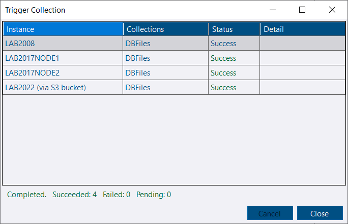
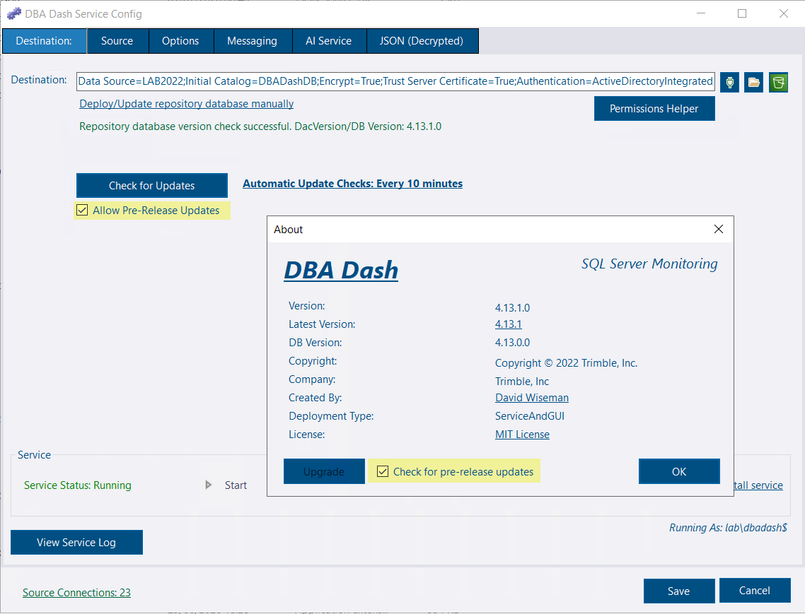

## Trigger collections across multiple instances

You can now trigger collections across multiple instances at once. Previously, collections could only be triggered one instance at a time. This is available on all tabs that have been converted to system reports, including the newly converted tabs in this release.

## System report conversions

In [4.12](../whats_new_in_4_12_0/), the DB Options tab was converted to a system report. This release continues that effort, converting the following tabs to system reports:

* **Backups**
* **Log Shipping**
* **Drives**
* **SQL Patching**
* **Job Status**
* **DB Files**
* **DB Space**

Converting to system reports simplifies the codebase and allows these tabs to benefit from custom report features such as triggering collections and opening in a new window.

## Custom report layout improvements

Custom reports now have better sizing of panels and more effective use of available space.

## Availability Group tab update

The Availability Group summary report now includes a trigger collection option. A bug where the snapshot date wasn't being reported has been fixed.

## Pre-release upgrade support

You can now automatically upgrade to a pre-release version of DBA Dash.


Pre-release versions are intended for testing and are not recommended for production.


## Other improvements

See the [4.13.0 release notes](https://github.com/trimble-oss/dba-dash/releases/tag/4.13.0) for a full list of fixes and improvements.
