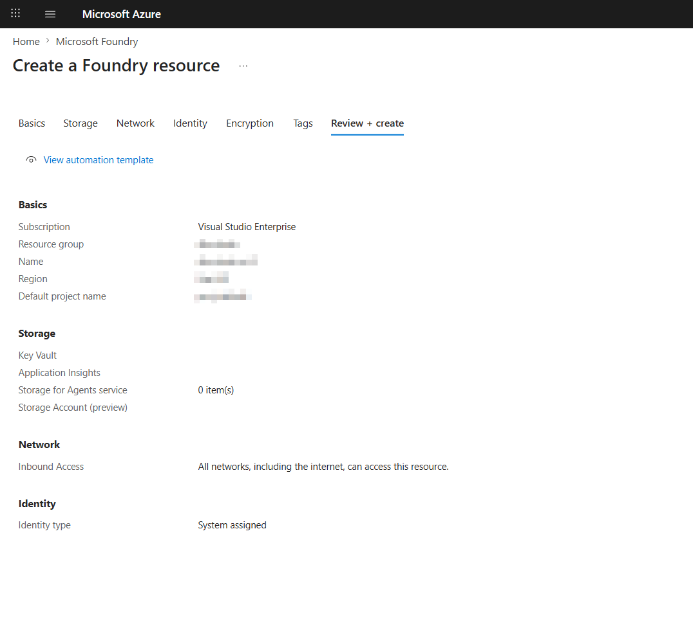
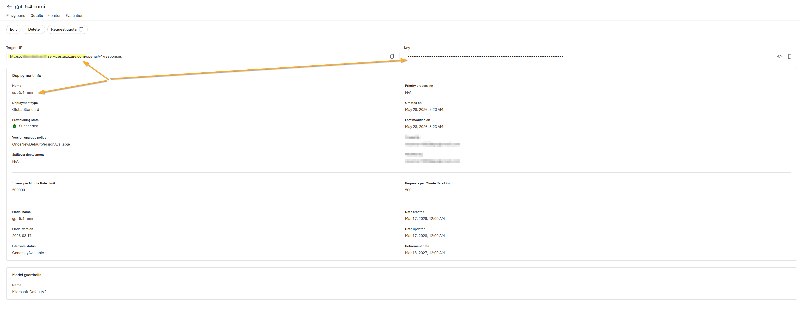
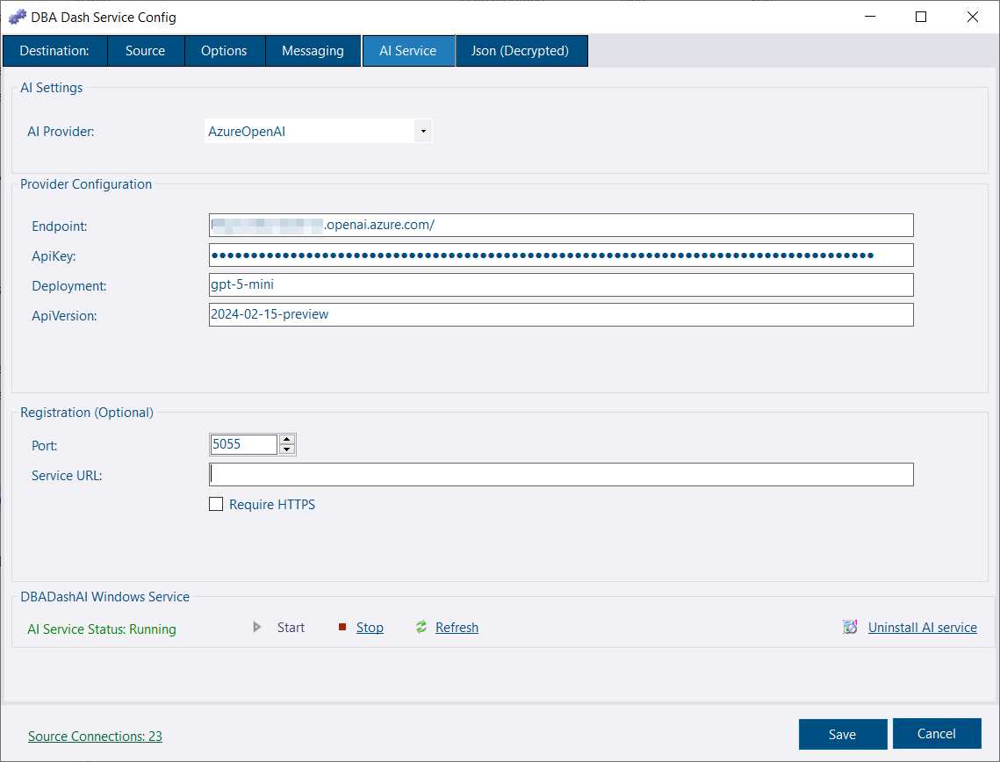

The AI Assistant analyses your DBA Dash repository data and answers natural-language questions about alerts, performance, waits, backups, blocking, slow queries, and more.

## How it works

Two components work together:

| Component | Role |
|---|---|
| **DBADashAI** (`DBADashAI.dll`) | ASP.NET Core web service. Runs SQL tools against the repository DB, optionally calls an LLM to summarise findings, and exposes `/api/ai/*` endpoints. |
| **DBADash GUI** | Discovers the AI service, calls the API, and renders the response in the AI Assistant tab. |

---
## Prerequisites

* [.NET 10.0.9](https://dotnet.microsoft.com/en-us/download/dotnet/10.0) or later is recommended. ASP.NET Core Runtime & .NET Desktop Runtime.

Use `dotnet --list-runtimes` to check installed versions.

---

## Quick Start (Azure Foundry)

* Open the Azure portal
* Create a Foundry resource
[](create-foundry.png)
* Open the new Foundry resource and go to the Foundry portal
* Go to Build
* Deploy a base model. Select a model and deploy, e.g., `gpt-5.4-mini`.
* Click the model in the grid.
* Click the details tab
[](azure-portal.png)

---

[](ai-assistant-configuration.png)

* Go to the AI Service tab in the DBA Dash service config tool
* Set the provider to AzureOpenAI
* Set the endpoint to the Target URI from the portal, omitting `/openai/v1/responses`, e.g., `https://****.services.ai.azure.com`
* Copy the ApiKey from the portal
* Set deployment to the deployment name, e.g., `gpt-5.4-mini`
* Set ApiVersion to `2024-12-01-preview`
* The registration service URL can be left blank to run in local mode. Or configure a URL to be used, allowing GUI clients running on other machines to discover the AI service.
* Click the link to install as a service.

The service will read the repository connection string from `ServiceConfig.json`. If the config file is encrypted, use the same account as the DBA Dash service to allow decryption, or see [Repository connection string](#repository-connection-string).

The service config tool creates/modifies the `appsettings.local.json` file which will override default settings from the `appsettings.json` file (overwritten on upgrade).

## Deployment modes

### Local mode (default — recommended for getting started)

Run `DBADashAI` on the same machine as the GUI. It binds to `localhost` only and requires no authentication — the loopback interface is the security boundary.

- No certificates required
- No API key required
- Not registered in the repository database
- Only the GUI on that machine can use it

**`appsettings.local.json` — leave `Registration:ServiceUrl` empty:**

```json
{
  "Registration": {
    "ServiceUrl": "",
    "Port": 5055
  }
}
```

### Shared/repository mode

Deploy `DBADashAI` on a central server accessible to all GUI clients. Set `Registration:ServiceUrl` to the URL that clients will connect to. The service binds to all interfaces, registers that URL in the repository database, and enforces API key authentication.

**`appsettings.local.json`:**

```json
{
  "Registration": {
    "ServiceUrl": "https://aiserver.corp.com",
    "Port": 5055
  },
  "Security": {
    "Enabled": true,
    "RequireHttps": true
  }
}
```

GUI clients discover the URL and API key automatically from the repository database — no client-side configuration needed.

---

## Configuration reference (`appsettings.local.json`)

All AI service configuration lives in `appsettings.local.json` in the `DBADashAI` folder. `ServiceConfig.json` is not used by the AI service except to inherit the repository connection string when they are co-located.

### Repository connection string

Required. Tells the AI service which DBA Dash database to query.

```json
{
  "ConnectionStrings": {
    "Repository": "Server=sql-server;Database=DBADashDB;Integrated Security=true;Encrypt=true;"
  }
}
```

If `DBADashAI` is deployed in the same folder as the collection service, this is inherited automatically from `ServiceConfig.json` and does not need to be set here.

### AI provider

At least one provider must be configured for the LLM summary to work. Without a provider the service still runs — tool data is returned but the `summary` field will be empty.

#### Azure OpenAI

```json
{
  "AI": { "Provider": "AzureOpenAI" },
  "AzureOpenAI": {
    "Endpoint": "https://<resource>.openai.azure.com",
    "ApiKey": "<key>",
    "Deployment": "<deployment-name>",
    "ApiVersion": "2024-12-01-preview"
  }
}
```

#### Anthropic (direct or via Azure Foundry)

```json
{
  "AI": { "Provider": "Anthropic" },
  "Anthropic": {
    "BaseUrl": "https://api.anthropic.com",
    "ApiKey": "<key>",
    "Model": "claude-3-5-sonnet-20241022",
    "Version": "2023-06-01",
    "MaxTokens": 1024
  }
}
```

For Anthropic via **Azure Foundry**, set `BaseUrl` to the base Foundry URL (ending in `/anthropic/`):

```json
{
  "Anthropic": {
    "BaseUrl": "https://<resource>.services.ai.azure.com/anthropic/",
    "ApiKey": "<foundry-api-key>",
    "Model": "<deployment-name>"
  }
}
```

If `AI:Provider` is not set, the service auto-selects the first fully-configured provider in the order: AzureOpenAI → Anthropic.

### Registration

```json
{
  "Registration": {
    "ServiceUrl": "",
    "Port": 5055
  }
}
```

| Key | Description |
|---|---|
| `ServiceUrl` | The URL registered in the repository DB for GUI discovery. Empty = local mode (loopback binding, no auth, no DB registration). |
| `Port` | Port to listen on. Used in both modes. |

### Security

Only applies in shared/repository mode (`ServiceUrl` set). In local mode, auth is automatically disabled.

```json
{
  "Security": {
    "Enabled": true,
    "RequireHttps": false,
    "KeyRotationDays": 30,
    "KeyGracePeriodHours": 24
  }
}
```

| Key | Description |
|---|---|
| `Enabled` | Enables authentication in shared/repository mode. API key authentication is the current authentication model. |
| `RequireHttps` | Redirects HTTP requests to HTTPS. Strongly recommended in shared/repository mode. |
| `KeyRotationDays` | Automatically rotates the shared API key after the specified number of days. Set `0` or less to disable rotation. |
| `KeyGracePeriodHours` | Grace period for previous keys during rotation. |

**⚠️ HTTPS in shared mode** — **Strongly recommended.** Without HTTPS, API keys are transmitted in plain text and can be intercepted on the network. Set `RequireHttps: true` and configure your binding via a reverse proxy (recommended) or Kestrel certificates. The health endpoint (`/api/ai/health`) is always unauthenticated for load-balancer probes.

### Logging

```json
{
  "Logging": {
    "LogLevel": {
      "Default": "Information",
      "Microsoft.AspNetCore": "Warning",
      "DBADashAI": "Information"
    }
  }
}
```

### Azure Key Vault (optional)

Store secrets in Key Vault instead of `appsettings.local.json`. Use `--` to represent hierarchy in secret names (e.g., `AzureOpenAI--ApiKey`).

```json
{
  "KeyVault": {
    "VaultUri": "https://<vault>.vault.azure.net/",
    "ManagedIdentityClientId": ""
  }
}
```

---

## Installing as a Windows service

Use the **AI Service** tab in the DBADashServiceConfig tool, or run `sc.exe` manually:

```powershell
sc.exe create DBADashAI `
    binPath="\"C:\Program Files\dotnet\dotnet.exe\" \"C:\DBADash\DBADashAI\DBADashAI.dll\"" `
    start= auto
sc.exe start DBADashAI
```

Configure the service by editing `appsettings.local.json` in the `DBADashAI` folder before or after installation. Restart the service to apply changes.

---

## GUI discovery

The GUI uses the following priority order to locate the AI service:

1. **Local probe** — always checks `http://localhost:5055` (or the URL in user settings) first. If reachable, uses it with no authentication. The health endpoint returns a repository fingerprint; if the local service is pointed at a different database than the GUI is connected to, a warning is shown and the tab is disabled.
2. **Repository database** — if no local service responds, reads `AI.ServiceConfig` for the shared service URL and API key registered by the central deployment.

If neither source is available the AI Assistant tab is hidden.

> **Role requirement** — Even when a service is reachable, the AI Assistant tab is only shown to users who are admins (**db_owner** or **sysadmin** on the repository database) or members of the **AIUser** role. If you can reach the service but the tab is still missing, verify that your repository login has one of these roles assigned.

---

## API endpoints

| Endpoint | Auth | Description |
|---|---|---|
| `GET /api/ai/health` | None | Service health + repository fingerprint |
| `GET /api/ai/diagnostics` | Required | Configuration summary (keys redacted) |
| `GET /api/ai/tools` | Required | Available tools and metadata |
| `GET /api/ai/examples` | Required | Example questions grouped by category |
| `GET /api/ai/models` | Required | Available LLM models |
| `POST /api/ai/ask` | Required | Ask a question |
| `POST /api/ai/proactive-digest` | Required | Proactive risk digest |
| `POST /api/ai/feedback` | Required | Submit helpful/not-helpful feedback |
| `GET /api/ai/feedback` | Required | Recent feedback |
| `GET /api/ai/test-anthropic` | Required | Test Anthropic provider connectivity and configuration |

---

## Troubleshooting

### Log files

The AI service writes detailed logs to `DBADashAI-log-YYYYMMDD.txt` files in the `Logs` folder located in the same directory as the service. Check these files first when diagnosing any issue — they capture startup errors, provider configuration problems, and request-level details that are not surfaced in the GUI.

### AI Assistant tab is not shown

- In local mode: verify the service is running — `Invoke-RestMethod http://localhost:5055/api/ai/health`
- In shared mode: check `AI.ServiceConfig` exists and `IsActive = 1` (heartbeat within 2 minutes)
- Verify that your repository login is **db_owner** or **sysadmin** on the repository database, or a member of the **AIUser** role — the tab is hidden for users who have neither

### "AI service is connected to a different repository"

The local service's `ConnectionStrings:Repository` points to a different database than the GUI is connected to. Either update the AI service connection string or switch the GUI to the matching repository.

### Summary is empty

The LLM provider is not configured or unreachable. Check `AI:Provider` and the corresponding provider section. Use `GET /api/ai/diagnostics` (authenticated) to inspect the resolved configuration.

### 401 Unauthorized

Shared mode only. The GUI retrieves the API key from the database automatically. If it fails, check that `AI.ServiceConfig` has a valid key and the GUI has read access to that table.

### Port conflict

Change `Registration:Port` in `appsettings.local.json` and restart. In local mode the GUI will probe `http://localhost:{port}` — update user settings in the GUI Options if using a non-default port.

### AI Service won't start

* Check that you have the correct .NET Runtime installed.  See [Prerequisites](#prerequisites)
* Check [log files](#log-files)
* Check for errors in Windows Event Viewer
