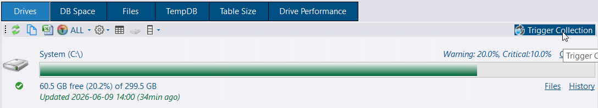
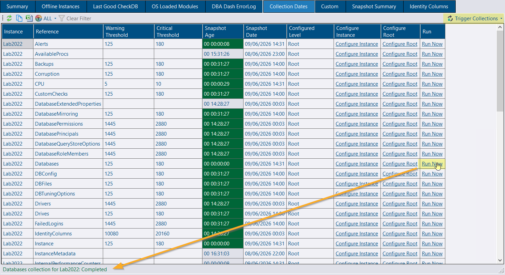
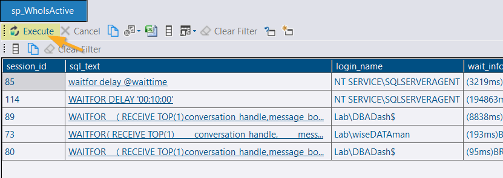
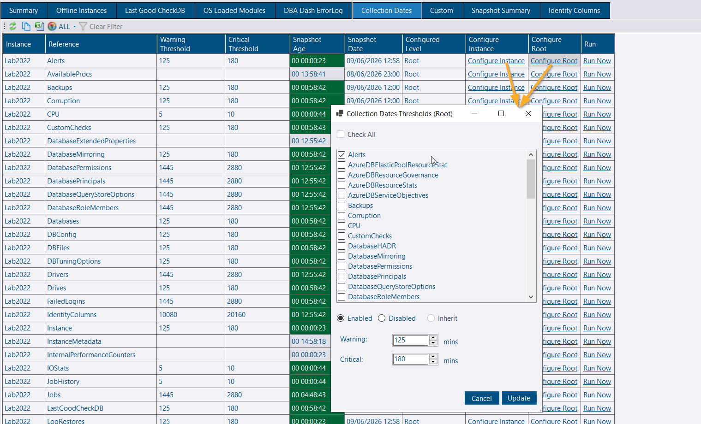
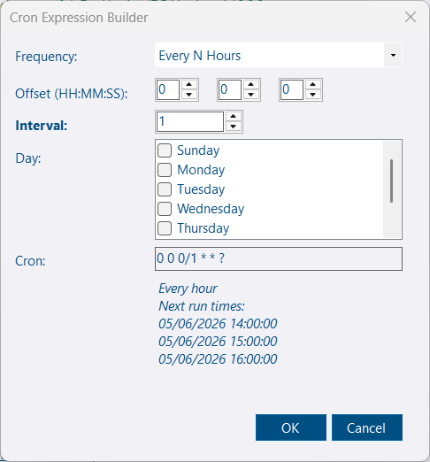
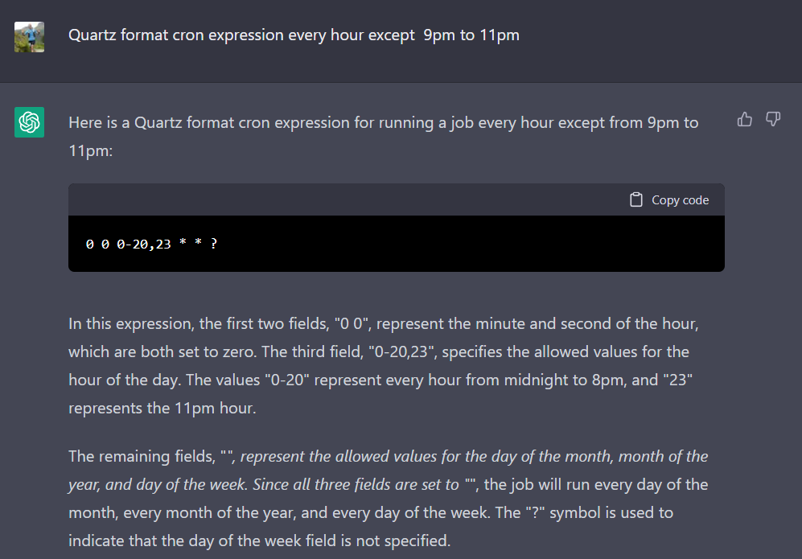

## Introduction

The service collects data from your monitored instances on a schedule defined below. Performance data is collected as frequently as every minute; other collections might only run once per day. The default schedules can be customized as needed - to run more or less frequently, at a specific time of day, or disabled entirely.

Schedules can be customized at the service level and you can also override schedules for individual instances.

## Schedule
### Every 1 min
- [ObjectExecutionStats](https://github.com/trimble-oss/dba-dash/blob/main/DBADash/SQL/SQLObjectExecutionStats.sql)
*Captures object execution stats from sys.dm_exec_procedure_stats, sys.dm_exec_function_stats & sys.dm_exec_trigger_stats*
- [CPU](https://github.com/trimble-oss/dba-dash/blob/main/DBADash/SQL/SQLCPU.sql)
*Capture CPU utilization from sys.dm_os_ring_buffers or sys.dm_db_resource_stats (Azure).*
- [RunningQueries](/docs/help/running-queries)
*Captures a snapshot of queries currently executing. Captures blocking chains so replaces blocking snapshot. Also captures query text and optionally captures query plans*
- [IOStats](https://github.com/trimble-oss/dba-dash/blob/main/DBADash/SQL/SQLIOStats.sql)
*Collects data from sys.dm_io_virtual_file_stats*
- [Waits](https://github.com/trimble-oss/dba-dash/blob/main/DBADash/SQL/SQLWaits.sql)
*Collects data from sys.dm_os_wait_stats*
- [PerformanceCounters](https://github.com/trimble-oss/dba-dash/blob/main/DBADash/SQL/SQLPerformanceCounters.sql)
*Collects data from sys.dm_os_performance_counters. Collection can be [customized](/docs/help/os-performance-counters), adding additional performance counters or collecting your own metrics with custom SQL.*
- [SlowQueries](/docs/help/slow-queries) (Not enabled by default)
*Captures queries that take longer than 1 second (or custom) to run using extended events*
- [JobHistory](https://github.com/trimble-oss/dba-dash/blob/main/DBADash/SQL/SQLJobHistory.sql)
*Collects job execution data from msdb.dbo.sysjobhistory (just what's new since the last collection)*
- [DatabasesHADR](https://github.com/trimble-oss/dba-dash/blob/main/DBADash/SQL/SQLDatabasesHADR.sql)
*Collects data from dm_hadr_database_replica_states if your SQL instance is using Always On Availability Groups.*
- [AvailabilityReplicas](https://github.com/trimble-oss/dba-dash/blob/main/DBADash/SQL/SQLAvailabilityReplicas.sql)
*Collects data from sys.availability_replicas*
- [AvailabilityGroups](https://github.com/trimble-oss/dba-dash/blob/main/DBADash/SQL/SQLAvailabilityGroups.sql)
*Collects data from sys.availability_groups*
- [MemoryUsage](https://github.com/trimble-oss/dba-dash/blob/main/DBADash/SQL/SQLMemoryUsage.sql)
*Collects data from sys.dm_os_memory_clerks*
- [ResourceGovernorWorkloadGroups](https://github.com/trimble-oss/dba-dash/blob/main/DBADash/SQL/SQLResourceGovernorWorkloadGroups.sql)
*Collects data from sys.dm_resource_governor_workload_groups, only if workload groups have been configured.*
- [ResourceGovernorResourcePools](https://github.com/trimble-oss/dba-dash/blob/main/DBADash/SQL/SQLResourceGovernorResourcePools.sql)
*Collects data from sys.dm_resource_governor_resource_pools, only if workload groups have been configured.*

#### Azure DB Only:
- [AzureDBElasticPoolResourceStats](https://github.com/trimble-oss/dba-dash/blob/main/DBADash/SQL/SQLAzureDBElasticPoolResourceStats.sql)
*Collects data from sys.elastic_pool_resource_stats*
- [AzureDBResourceStats](https://github.com/trimble-oss/dba-dash/blob/main/DBADash/SQL/SQLAzureDBResourceStats.sql)
*Collects data from sys.dm_db_resource_stats*

### Every Hour
- [ServerProperties](https://github.com/trimble-oss/dba-dash/blob/main/DBADash/SQL/SQLServerProperties.sql)
*Various SERVERPROPERTY() function calls to get server property information.*
- [Databases](https://github.com/trimble-oss/dba-dash/blob/main/DBADash/SQL/SQLDatabases.sql)
*Collect data from sys.databases*
- [SysConfig](https://github.com/trimble-oss/dba-dash/blob/main/DBADash/SQL/SQLSysConfig.sql)
*Collect data from sys.configurations*
- [Drives](https://github.com/trimble-oss/dba-dash/blob/main/DBADash/SQL/SQLDrives.sql) *(When not collected via WMI)*
*Drive collection is done via WMI if possible as this method can collect data from all volumes. The SQL collection method only collects drive capacity and free space for volumes that contain database files.*
- [DBFiles](https://github.com/trimble-oss/dba-dash/blob/main/DBADash/SQL/SQLDBFiles.sql)
*Collects data from sys.database_files for every database. Uses sys.master_files to collect data for databases that are not accessible.*
- [Backups](https://github.com/trimble-oss/dba-dash/blob/main/DBADash/SQL/SQLBackups.sql)
*Gets the last backup of each type for every database from msdb.dbo.backupset*
- [LogRestores](https://github.com/trimble-oss/dba-dash/blob/main/DBADash/SQL/SQLLogRestores.sql)
*Collects the last log file restored for each database*
- [ServerExtraProperties](https://github.com/trimble-oss/dba-dash/blob/main/DBADash/SQL/SQLServerExtraProperties.sql)
*Collects server level data from various sources. Some data collections require Sysadmin permissions and xp_cmdshell - these will be skipped if not available. e.g. Processor name, power plans & more*
- [DBConfig](https://github.com/trimble-oss/dba-dash/blob/main/DBADash/SQL/SQLDBConfig.sql)
*Collect data from sys.database_scoped_configurations*
- [Corruption](https://github.com/trimble-oss/dba-dash/blob/main/DBADash/SQL/SQLCorruption.sql)
*Collect data from msdb.dbo.suspect_pages, msdb.sys.dm_db_mirroring_auto_page_repair & msdb.sys.dm_hadr_auto_page_repair*
- [OSInfo](https://github.com/trimble-oss/dba-dash/blob/main/DBADash/SQL/SQLOSInfo.sql)
*Collect data from sys.dm_os_sys_info*
- [TraceFlags](https://github.com/trimble-oss/dba-dash/blob/main/DBADash/SQL/SQLTraceFlags.sql)
*Gets trace flags that are enabled globally with DBCC TRACESTATUS(-1)*
- [DBTuningOptions](https://github.com/trimble-oss/dba-dash/blob/main/DBADash/SQL/SQLDBTuningOptions.sql)
*Returns data from sys.database_automatic_tuning_options for each database*
- [LastGoodCheckDB](https://github.com/trimble-oss/dba-dash/blob/main/DBADash/SQL/SQLLastGoodCheckDB.sql)
*Note: This collection requires Sysadmin permissions*
- [Alerts](https://github.com/trimble-oss/dba-dash/blob/main/DBADash/SQL/SQLAlerts.sql)
*Collect data from msdb..sysalerts*
- [CustomChecks](https://github.com/trimble-oss/dba-dash/blob/main/DBADash/SQL/SQLCustomChecks.sql)
Add [your own](/docs/help/custom-checks) checks to DBA Dash.
- [DatabaseMirroring](https://github.com/trimble-oss/dba-dash/blob/main/DBADash/SQL/SQLDatabaseMirroring.sql)
*Collect data from sys.database_mirroring*
- [Jobs](https://github.com/trimble-oss/dba-dash/blob/main/DBADash/SchemaSnapshotDB.cs)
*Collects metadata for SQL Agent jobs including a DDL snapshot using SMO. A lightweight check is run every hour to see if any jobs have been modified since the last collection. If any jobs have been modified, the collection will run. The lightweight check won't detect some changes like changes to job schedules. After 24hrs, the collection is run even if no modification to jobs is detected.*
- [AzureDBResourceGovernance](https://github.com/trimble-oss/dba-dash/blob/main/DBADash/SQL/SQLAzureDBResourceGovernance.sql)
*Returns configuration and capacity settings for Azure DB from [sys.dm_user_db_resource_governance](https://learn.microsoft.com/en-us/sql/relational-databases/system-dynamic-management-views/sys-dm-user-db-resource-governor-azure-sql-database)*
- [ServerServices](https://github.com/trimble-oss/dba-dash/blob/main/DBADash/SQL/SQLServerServices.sql)
*Returns information from [sys.dm_server_services](https://learn.microsoft.com/en-us/sql/relational-databases/system-dynamic-management-views/sys-dm-server-services-transact-sql)*

#### Azure DB Only:
- [AzureDBServiceObjectives](https://github.com/trimble-oss/dba-dash/blob/main/DBADash/SQL/SQLAzureDBServiceObjectives.sql)
*Collects data from sys.database_service_objectives*
- [AzureDBResourceGovernance](https://github.com/trimble-oss/dba-dash/blob/main/DBADash/SQL/SQLAzureDBResourceGovernance.sql)
*Collects data from sys.dm_user_db_resource_governance*

### Daily @ Midnight
- [ServerPrincipals](https://github.com/trimble-oss/dba-dash/blob/main/DBADash/SQL/SQLServerPrincipals.sql)
*Collects data from sys.server_principals*
- [ServerRoleMembers](https://github.com/trimble-oss/dba-dash/blob/main/DBADash/SQL/SQLServerRoleMembers.sql)
*Collects data from sys.server_role_members*
- [ServerPermissions](https://github.com/trimble-oss/dba-dash/blob/main/DBADash/SQL/SQLServerPermissions.sql)
*Collects data from sys.server_permissions.*
- [DatabasePrincipals](https://github.com/trimble-oss/dba-dash/blob/main/DBADash/SQL/SQLDatabasePrincipals.sql)
*Collects data from sys.database_principals for each database*
- [DatabaseRoleMembers](https://github.com/trimble-oss/dba-dash/blob/main/DBADash/SQL/SQLDatabaseRoleMembers.sql)
*Collects data from sys.database_role_members for each database*
- [DatabasePermissions](https://github.com/trimble-oss/dba-dash/blob/main/DBADash/SQL/SQLDatabasePermissions.sql)
*Collects data from sys.database_permissions for each database*
- [VLF](https://github.com/trimble-oss/dba-dash/blob/main/DBADash/SQL/SQLVLF.sql)
*Gets the Virtual Log File Count for each database.*
- [DriversWMI](https://github.com/trimble-oss/dba-dash/blob/main/DBADash/DBCollector.cs)
*Collects driver information from Win32_PnPSignedDriver via WMI.*
- [OSLoadedModules](/docs/help/os-loaded-modules)
*Collects data from sys.dm_os_loaded_modules - can be used to check if antivirus has loaded into SQL Server address space*
- [ResourceGovernorConfiguration](https://github.com/trimble-oss/dba-dash/blob/main/DBADash/SchemaSnapshotDB.cs)
*Scripts resource governor configuration using SMO*
- [DatabaseQueryStoreOptions](https://github.com/trimble-oss/dba-dash/blob/main/DBADash/SQL/SQLDatabaseQueryStoreOptions.sql)
*Collects data from sys.database_query_store_options for each database*
- [IdentityColumns](/docs/help/identity-columns)
*Collects last identity value and row count for tables with identity values exceeding the capture threshold for % used*

### Daily @ 11pm
- [Database Schema Snapshots](https://github.com/trimble-oss/dba-dash/blob/main/DBADash/SchemaSnapshotDB.cs) (Not enabled by default)
*Creates a schema snapshot of databases using SMO. This only runs for the databases listed in SchemaSnapshotDBs - schema snapshots won't run unless this option has been set. See [here](/docs/help/schema-snapshots) for more info.*
- [AvailableProcs](https://github.com/trimble-oss/dba-dash/blob/main/DBADash/SQL/SQLAvailableProcs.sql)
*Gets stored procs available in the current database. Used for [Custom Tools](/docs/help/custom-tools/) feature.*
- [InstanceMetadata](https://github.com/trimble-oss/dba-dash/blob/89b15d65c5810c1b94513503b2e5eeaf5576d082/DBADash/InstanceMetadata/InstanceMetadataBase.cs)
*PowerShell script to provide additional information for [AWS](https://github.com/trimble-oss/dba-dash/blob/89b15d65c5810c1b94513503b2e5eeaf5576d082/DBADash/InstanceMetadata/AWSInstanceMetadata.cs) and [Azure](https://github.com/trimble-oss/dba-dash/blob/89b15d65c5810c1b94513503b2e5eeaf5576d082/DBADash/InstanceMetadata/AzureInstanceMetadata.cs) cloud providers.*

### Disabled by default
- [TableSize](https://github.com/trimble-oss/dba-dash/blob/main/DBADash/SQL/SQLTableSize.sql)
*Table row count and disk space usage*
- [FailedLogins](/docs/help/failed-logins)
*Collects failed login information from the SQL Server error log*

## Triggering collections on demand

* ⚠️The green refresh icon in the GUI is **not** a way to trigger a collection - it only refreshes data from the repository database. How fresh the data is depends on the schedule for the collection. Many reports include a *Snapshot Age*/*Snapshot Date* column that indicates when the data was collected from your monitored instance.
* Some reports include a *Trigger Collection* button that will cause the collection to run on demand outside its scheduled execution and update the report. This requires the [Messaging](/docs/help/messaging/) feature to be enabled.

* Collections can be triggered to run on demand by clicking the *Run Now* link in the *Collection Dates* tab under the *Checks* node of the tree. This requires the [Messaging](/docs/help/messaging/) feature to be enabled.

* Some reports are executed on your monitored instances and are not scheduled for collection. These reports will have an *Execute* button instead of a green refresh button. [Custom Tools](/docs/help/custom-tools/) are an example of this and the system also has certain reports like *Query Store* that are retrieved from monitored instances rather than the repository database. These also require the [Messaging](/docs/help/messaging/) feature to be enabled. The GUI retrieves data from monitored instances via the service.

## Schedule Customization

The application has a default schedule listed above which aims to provide a good balance for most instances. If you increase the frequency of data collection, you will increase the monitoring impact and it could also increase the size of your DBA Dash repository database. Less frequent collection could mean that the data is stale or doesn't provide enough granularity for performance troubleshooting.
If you need to adjust the default schedule to better meet your needs, this can be done using the DBA Dash Service Config tool.

* In the Options tab click "Configure Schedule".
* Click the link in the **Schedule Description** column.
* Use the cron expression builder to select the desired frequency.
* Alternatively, uncheck the Default checkbox in the grid and enter a valid Quartz compatible cron expression in the **Schedule** column.
* Check/Uncheck the option to run the collection on service start as required

To disable a collection:
* Select the row using the grid row header
* Click the **Disable** button on the toolbar
* Alternatively, set the cron expression to a blank string


Collections that share the same schedule run serially per instance and in parallel across instances, limiting monitoring impact.


The schedule data is saved in the ServiceConfig.json for any collections that you have overridden from the default values. The application defaults are configured in [this source file](https://github.com/trimble-oss/dba-dash/blob/main/DBADash/CollectionSchedule.cs).

## Bulk Edits

To make it easier to apply updates to a group of schedules you can use the bulk edit features. Use the row headers (highlighted above) to select the full row. Select a single row to copy the schedule for that row. Select the collections you want to update to have the same schedule and click paste. There are also options to reset back to the default schedules or to disable the selected collections.

## Per-Instance Customization

If you configure the schedule in the options tab it will apply to all the monitored SQL instances for that agent. If you want to adjust the schedule for a specific instance, click the "Source" tab. In the "Existing Connections" grid, click the "Schedule" link to edit the schedule for a specific instance. Any collections you don't override the schedule for will be inherited from the agent-level configuration described earlier or from the built-in application default values.


If you have groups of instances that require different schedules, consider using separate instances of the DBA Dash service. You can run multiple instances of the service on the same computer by deploying to a different folder and editing the `ServiceName` to be unique in the JSON tab of the config tool before installing the service.


## Collection Thresholds

Collections have thresholds associated with them to alert you if a collection hasn't successfully run within an expected period of time. Issues are highlighted on the *Snapshot Age* column in the Summary tab. If you adjust thresholds or disable a collection, you will also need to adjust the associated collection threshold on the *Collection Dates* tab.

* Clicking the *Configure Root* link will allow you to set thresholds that apply to all instances.
* Clicking the *Configure Instance* link will allow you to override thresholds for a specific instance.

## How collections are scheduled & executed

The scheduling in DBA Dash is designed to work well even when monitoring a very large number of instances. It prioritizes regular performance collections over collections scheduled to run less frequently - ensuring they run on time when available worker threads are limited. It also ensures that less frequent collections are able to run when there is contention for threads, but can't monopolize the available worker threads. The scheduling is backed by a queueing system which ensures reliable and fair processing of collections.

* [Quartz.NET](https://www.quartz-scheduler.net/) is used for scheduling
* A single job is created per schedule/collection combination.  *Note: Cron expressions are normalized, so equivalent cron expressions **might** be grouped together.*
* Quartz jobs fire at scheduled time, iterate through instances, and **queue collections** using .NET Channels
* Quartz jobs are responsible for queuing work, not executing it.
* **Intelligent prioritization**: Work is distributed across High/Normal/Low priority queues based on collection frequency
* **Duplicate protection**: If a previous collection group for an instance is still queued, new work is skipped with a warning. This prevents the queue from growing.
* **Smart dequeuing**:
  - 80% chance of processing High priority work first
  - 15% chance for Normal priority
  - 5% chance for Low priority
  - Ensures all priority levels get processed even when high-priority queues are busy
* **Resource management**: Low priority work (like schema snapshots) is limited to 25% of available worker threads, preventing thread starvation
* Collections scheduled to run at the same time will execute serially on each instance, limiting the monitoring impact.
* Collections for different instances will run in parallel based on the configured worker threads.

## Cron Expressions

Schedules can be configured in DBA Dash using cron expressions or you can enter a value in seconds.


DBA Dash [now includes](/blog/whats-new-in-4.11/) a cron expression builder so you don't need to memorize the syntax or search online for examples.  Just click the link in the *Schedule Description* column.



### Examples

**Cron:**
* `0 0/1 * * * ?` Every 1 min
* `0 0/5 * * * ?` Every 5 min
* `0 0/10 * * * ?` Every 10 min
* `0 0/15 * * * ?` Every 15 min
* `0 0/30 * * * ?` Every 30 min
* `0 0 0/1 * * ?` Every hour
* `0 0 0/2 * * ?` Every 2 hrs
* `0 0 0 * * ?` 12am
* `0 0 23 * * ?` 11pm

**Time in seconds:**
* `300` Every 5 min (300 seconds)
* `60` Every 1 min (60 seconds)
* `30` Every 30 seconds

*(Execution times will vary based on when the service is started. Use a cron expression if you need more control over the actual execution time)*

### Additional Resources

* [Quartz.NET documentation](https://www.quartz-scheduler.net/documentation/quartz-3.x/tutorial/crontriggers.html#example-cron-expressions).
* [Cron trigger tutorial](http://www.quartz-scheduler.org/documentation/quartz-2.3.0/tutorials/crontrigger.html).
* [Wikipedia page](https://en.wikipedia.org/wiki/Cron).

> **Note**: DBA Dash has a "Schedule Description" column that you can use to validate your cron expression.

### Cron Generators
* [freeformatter.com](https://www.freeformatter.com/cron-expression-generator-quartz.html#crongenerator)
* [crontab.cronhub.io](https://crontab.cronhub.io/)

Also try [ChatGPT](https://chat.openai.com/chat):

Include 'Quartz format cron expression' as this should increase the chances of generating a compatible cron expression. DBA Dash uses Quartz.NET for scheduling.
